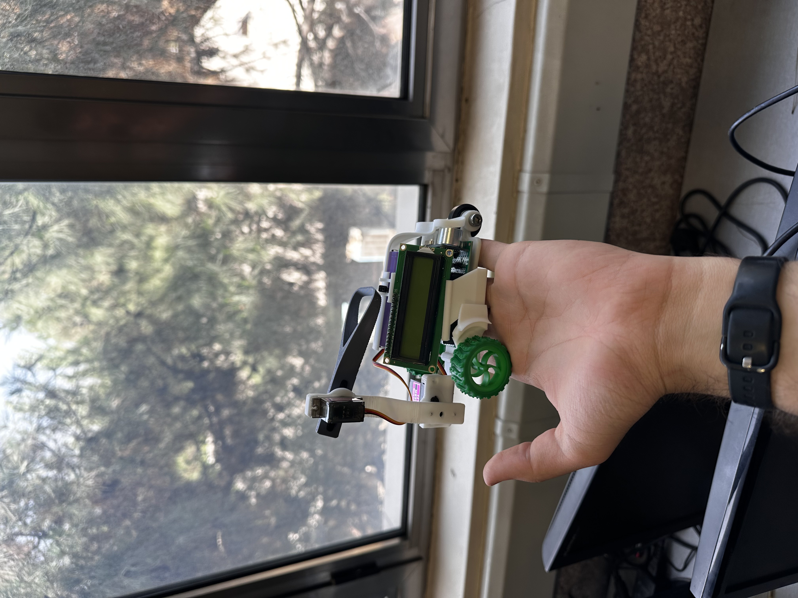

# AI Crawling Bot 🐛

An educational crawling robot platform designed for AI students. This project provides everything needed to design, build, and program an autonomous crawling robot — including 3D models, firmware, logic templates, and full documentation.

---

## 📦 What’s Inside

- `template.ino`: This is the starting point for your AI logic. Modify it to define how the robot should behave.
- 3D models in Rhino and export formats for viewing or printing.
- Guides for assembly, deployment, and usage.
- Diagrams and images for wiring and construction help.

---

## 🛠️ Getting Started

### 1. Clone the Repository

```bash
git clone https://github.com/amirali-lll/crawling-bot.git
```

### 2. Open and Edit the Logic Template

Modify the file:

```bash
templates/template.ino
```

Use it to define how the robot should behave. You’ll write AI logic here.

### 3. Upload Logic

Follow the steps in the [User Guide](docs/installation.md) to upload your logic to the robot.

---

## 🧱 Repository Structure

| Folder | Contents |
|--------|----------|
| `templates/` | Starter `.ino` logic file to customize |
| `designs/` | 3D robot designs in Rhino (`.3dm`) and export formats (`.stl`, `.obj`) |
| `docs/` | Written guides, wiring diagrams, and usage instructions |

---

## 🖨️ 3D Model Exports

In the `designs/` directory:
- `robot-design.3dm` — original Rhino model
- `exports/robot.stl`, `robot.obj` — printable and viewable 3D exports
- `exploded-view.png` — visual reference for assembly

---

## 📚 Documentation

### Video Guide
For a detailed overview of the robot and its components, watch the video:

[▶️ AI Crawling Bot Overview (Google Drive)](https://drive.google.com/file/d/1TIa0ktaaaPdPyBMpJnHhDxLsFk6jlDfr/view?usp=share_link)

[🚀 AI Crawling Bot Overview (Telegram)](https://t.me/ai4032_iust/126)


### Written Guides

- [`docs/installation.md`](docs/installation.md): Software installation and environment setup
- [`docs/robot-overview.md`](docs/robot-overview.md): Overview of the robot's components and assembly


### Images

- `docs/images/`

---

## 📸 Preview




---

## ⚖️ License

This project is licensed under the [MIT License](LICENSE). You are free to use, modify, and distribute this project for educational and non-commercial purposes.

---

## 🙋‍♀️ For Students

Students should:
- Fork or clone this repository.
- Modify `templates/template.ino` with their own logic.
- Deploy it to the crawling robot using the guides provided.
- Do **not** submit modified versions of this repository unless instructed.

---

## ❤️ Built for Education

This robot and its codebase were created as part of an AI course to help students learn real-world robotics, AI behavior programming, and system integration.

---
