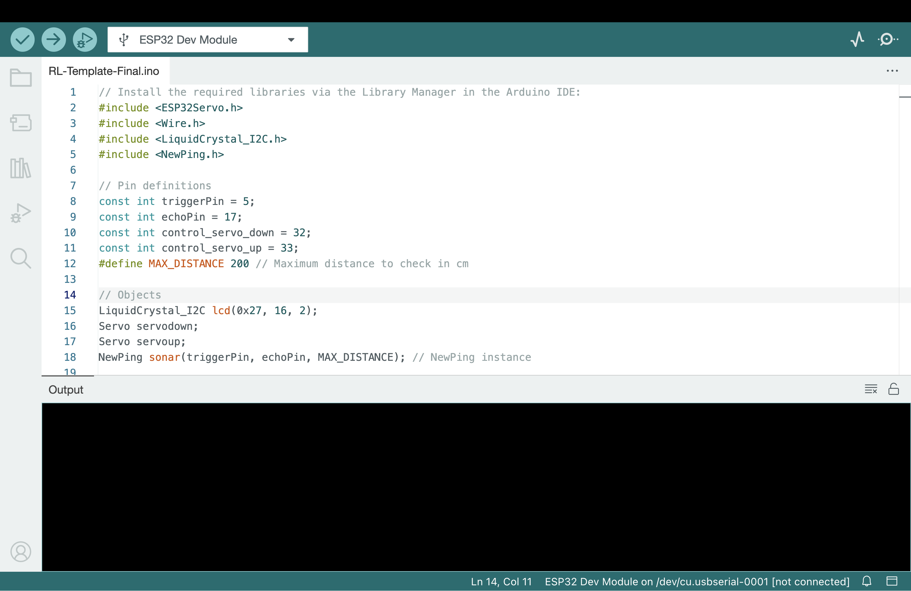
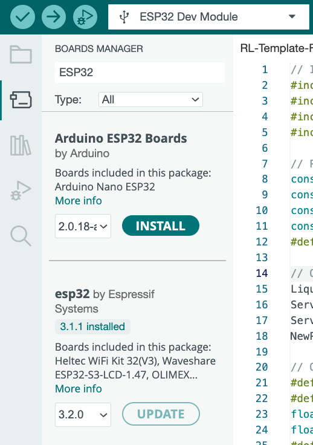
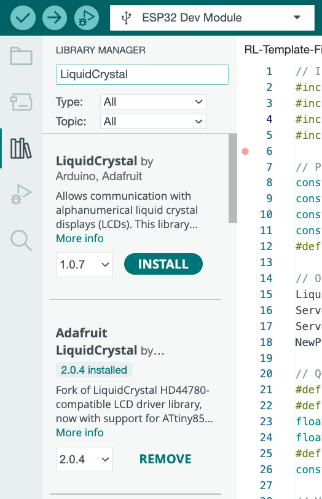
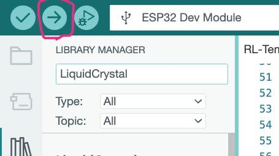
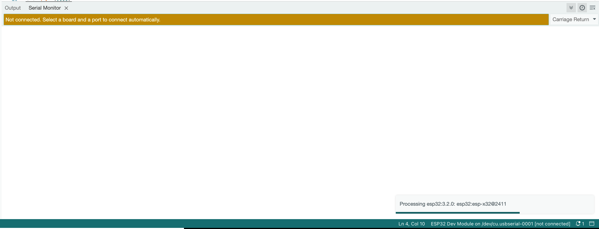

# Installation Guide

This guide will help you set up the required software and configure your Arduino for the project.

## Prerequisites 🛠️

- ESP Board (e.g., ESP32, ESP8266)
- USB cable for Arduino
- Computer with internet access

## 1. Install Arduino IDE 💻

1. Go to the [Arduino Software page](https://www.arduino.cc/en/software).
2. Download the Arduino IDE for your operating system (Windows, macOS, or Linux).
3. Install the IDE following the on-screen instructions.

   

## 2. Config Arduino IDE for ESP Boards ⚙️

1. Open the Arduino IDE.
2. Go to **File > Preferences**.
3. In the **Additional Boards Manager URLs** field, add the following URL for ESP boards:
   ```
   https://dl.espressif.com/dl/package_esp32_index.json
   ```
4. Click **OK** to save the preferences.
5. Go to **Tools > Board > Boards Manager...**.
6. Search for "ESP32" or "ESP8266" and install the relevant package. name it "ESP32 by Espressif Systems" or "ESP8266 by ESP8266 Community".


   
    

## 3. Add the Template Logic
1. Clone the repository to your local machine:
```bash
git clone https://github.com/amirali-lll/crawling-bot.git
```
2. Create new Sketch in Arduino IDE **File > New Sketch**.
3. Copy the contents of `templates/template.ino` into your new sketch.
4. Save the sketch with a meaningful name.


## 4. Install Required Libraries 📚
1. Select the Library Manager from the Arduino IDE (It is located at the left side of the IDE).
2. Search for and install any libraries required by your project (Each library is mentioned in the `template.ino`)




## 5. Upload the Code ⬆️
1. Connect your ESP board to your computer using a USB cable.
2. In the Arduino IDE, go to **Tools > Board** and select your ESP board model **ESP32 Dev Module**.
3. Go to **Tools > Port** and select the port corresponding to your ESP board.
4. Click the **Upload** button (right arrow icon) to compile and upload the code to your ESP board.

   


## 6. Verify Configuration ✅ (Optional)
- Open the **Serial Monitor** (Tools > Serial Monitor) to check output and ensure the ESP board is running as expected.
