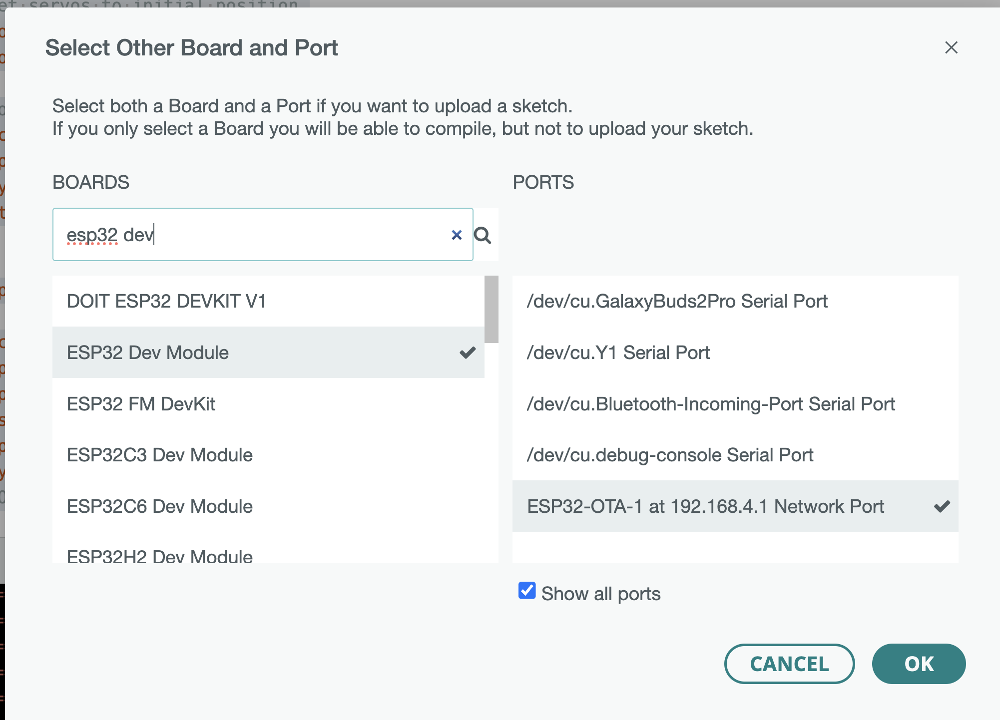
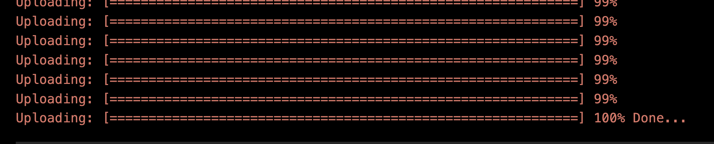

# OTA (Over-the-Air) Update Guide 🚀

With OTA enabled, you can upload new code to your robot wirelessly—no USB cable required! This guide will walk you through the process step by step.

---

## ⚠️ Important: Never Remove OTA Configuration
OTA (Over-the-Air) is essential for wireless code updates. **Do not remove or comment out the OTA-related code in `template.ino`** (including `setup_ota()`, `ArduinoOTA`, and the AP/OTA hostname logic). Removing these lines will disable wireless uploading and make future updates much harder. Always keep the OTA configuration in your firmware for easy updates!

---

## Prerequisites
- Your robot is powered on and running the OTA-enabled firmware (see `template.ino`).
- The robot is broadcasting its WiFi Access Point (AP), e.g., `ESP32-AP-1`. 
- The robot's WiFi Access Point (AP) name follows the format `ESP32-AP-<BOT-NUMBER>` (e.g., `ESP32-AP-3` for robot number 3).
- Your computer has WiFi and Arduino IDE installed.

---

## 1. Prepare Your Code
- Open your `.ino` file in the Arduino IDE.
- Make sure your code compiles without errors.

---

## 2. Connect to the Robot's WiFi AP 📶
1. On your computer, open the WiFi settings.
2. Find and connect to the robot's AP (e.g., `ESP32-AP-1`).
   - Password: `12345678`
3. Wait until you are fully connected. You may lose internet access while connected to the robot.

---

## 3. Select the OTA Port in Arduino IDE ⚡
1. In Arduino IDE, go to **Tools > Port**.
2. Look for a network port named like `ESP32-OTA-1 at xxx.xxx.xxx.xxx` (the number matches your robot number).
3. Select this network port.
> **Note:** Before uploading, ensure that **Tools > Board** is set to **ESP32 Dev Module** in the Arduino IDE. Selecting the correct board is required for successful OTA uploads.

---

## 4. Upload Code Over OTA ⬆️
1. Click the **Upload** button (right arrow icon) in the Arduino IDE.
    - OTA Password: `admin`
2. The IDE will compile your code and upload it wirelessly to the robot.
3. Watch the progress in the IDE and on the robot's LCD (it will show OTA progress and status).

---

## 5. Success! 🎉
- When the upload is complete, the robot will restart and run your new code.
- The LCD will display "OTA Update Done" and then return to normal operation.

---

## Troubleshooting
- **Can't see the OTA port?**
  - Make sure you are connected to the robot's WiFi AP.
  - Wait a few seconds after connecting for the port to appear.
  - Restart Arduino IDE if needed.
- **Upload fails?**
  - Ensure only one computer is connected to the robot's AP.
  - Make sure the robot is powered and not busy with another OTA update.

---

## Tips
- You can always switch back to USB upload if needed.
- For multiple robots, each will have a unique AP and OTA hostname (e.g., `ESP32-AP-2`, `ESP32-OTA-2`).

---

Now you can update your robot's code quickly and wirelessly!
